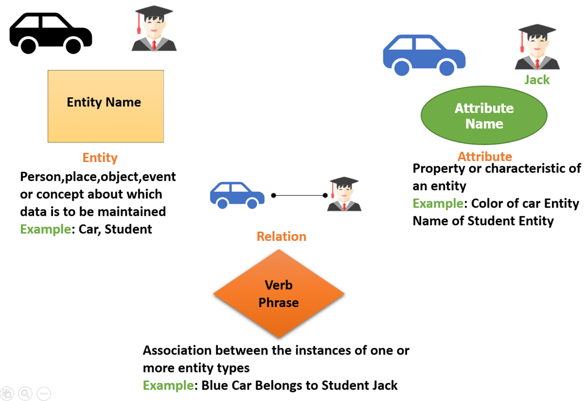

# Background Information: Entity Relationship Diagrams (ERD)

Today we will focus on the concepts of entities being stored in a database, and then how to think about, and design, the relationships between the different entities.  Specifically, we will look at:

1. Representing an entity in an ERD.
1. Representing a relationship (i.e. cardinality) between entities.
1. Representing an attribute, or field, on an entity.

An Entity Relaionship Diagram (ERD) is just that...it's a diagram that represents the entities you work with (i.e. Products, Customers and Sales) and their relationships to each other. A database diagram is the technical representation of an ERD. In the diagram below we see how an ERD gives us a sense about how we can organize our database. We get a glimps into how products might relate to categories, colors and sizes.

ERDs help to organize all the information about your organization's data structure.

## Let's break down the components of an ERD.

1. **The entity** - An entity is a definable concept within a system such as, people (i.e. Customers, Sales Person), objects (i.e. Invoice, Cars), or events (i.e. Transactions). Entities are usually nouns and they are also the name given to a table. For example, there would be a Customers table with customer attributes.
1. **The relationship** - A relationship is descriptive of how entities relate to each other. For example, ONE SalesPerson may have MANY sales or ONE employee may have ONE Badge.
1. **The attributes** - Attributes are properties and characteristics of an entity such as, first_name, last_name of a Customer.

 
 

 
 

## Relationship Cardinality in databases
In database design you may hear about *maxiumum cardinality*. It refers to how relationships are defined between database data. It's about how data in one table relates to data in another table. Though there are more realtionship cardinalities let's focus on these three below.

 
 

It is possible to be more specific with your cardinalities, this is done using minimum cardinalities. *Minimum cardinality* defines the lowest possible relationship required for a relationship. For instance, it maybe required that ONE Student get assigned to 0 OR ONE computer. The symbols you see below help describe the various relationship cardinalities. Minimum cardinality symbols sit on the inside of maximum cardinalities. Now see how the one-to-one relationship would now look with a minimum included.

### Below is a diagram of ERD cardinalities you can use:

### Intro Material
*Review these materials before attempting the practice problems.

1. [Intro Video (6 min)](https://www.youtube.com/watch?v=xsg9BDiwiJE) 
1. [What is an Entity Relationship (ER) Diagram](https://creately.com/guides/er-diagrams-tutorial/)

# Practice

### Tools

For these exercises you will need a Lucid Chart account.  Go to  [lucidchart.com](lucidchart.com) and register for a free account. Read about [Lucid ERD features](https://www.lucidchart.com/pages/examples/er-diagram-tool).  To get started, follow the steps below:

1. Go to [Lucidchart Templates](https://app.lucidchart.com/documents#/templates?folder_id=home&browser=icon) and search for `ERD`.
2. Click `Open Template` for the template named `Database ER diagram (crow's foot)` to get started.
3. Be sure to click the `Share` button in the top right corner and share your ERD with your instructors.

### Practice: Doctors and Patients

Use Lucid Chart to create an ERD that represents the entities of **Doctor** and **Patient**.

1. What would be good attributes, or fields, for each entity?
1. What is the relationship between the two entities?
1. What should be the primary key on each entity?
1. Which should hold the primary key of the other as a foreign key?

### Practice: Coffee Roasters and Suppliers

Use Lucid Chart to create an ERD that represents the entities of **CoffeeShop**, **CoffeeSupplier**, and **CoffeeDrinker**.

1. What would be good attributes, or fields, or each entity?
1. What is the relationship between the three entities?
1. What should be the primary key on each entity?
1. Which should hold the primary key of the other as a foreign key?

## Further Resources (Optional)
*Use these resources if you are still too confused to complete the practice exercises above.  

1. [Entity Relationship Diagram (ERD) Tutorial - Part 1 (7 min)](https://www.youtube.com/watch?v=QpdhBUYk7Kk)
1. [Entity Relationship Diagram (ERD) Tutorial - Part 2 (14 min)](https://www.youtube.com/watch?v=-CuY5ADwn24)
1. [Lucid Charts: ERD tutorial](https://www.lucidchart.com/pages/er-diagrams)

