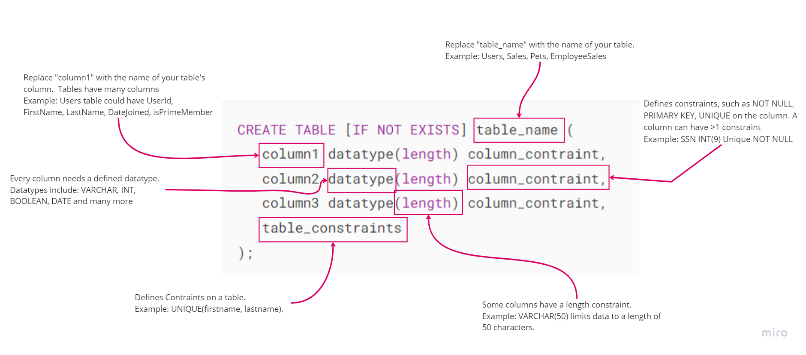
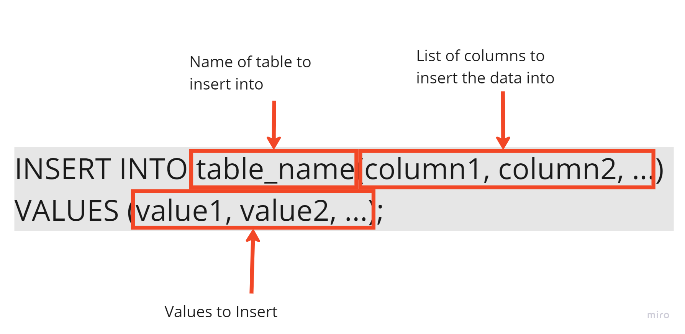
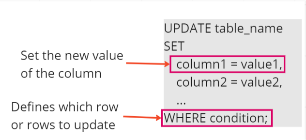

# Database Actions

Today we will look at the basic commands used to structure a database and the data inside it.  Some commands like `CREATE` and `ALTER` modify the structure of the tables while others like `INSERT`, `UPDATE`, and `DELETE` modify the data in the database tables.  

## Background Information


### CREATE
The `CREATE` command is used to make a new Database or Table.  

To create a new database, you simply need to use the command
re
```SQL
CREATE DATABASE NameOfNewDatabase;
```
where NameOfNewDatabase is replaced with what you want to name the database.  For example, is you were creating a new database named `Gradebook`, you would use:

```
CREATE DATABASE Gradebook;
```
There are some optional parameters the CREATE DATABASE command can take.  Those are beyond the scope of this course, but there are resources in the Deep Dive section.

The syntax to create a table is a bit more complex.  There are many other things such as column details and constraints to consider when creating a table.  Below is the anatomy of the `CREATE TABLE` command.


<br>
In a database table, each column needs to be defined separetly.  This includes giving the column name, the datatype and any constraints.  

<br>

There are many different datatypes, but most common are **Datatypes** Int, VARCHAR, BOOL, DATE, TIMESTAMP and more. A complete list of datatypes can be found in the documentation [here](https://www.postgresql.org/docs/current/datatype.html).

 <br>
**Constraints** can be defined on the column or on the table itself.  When defined on the table, it is  because it applies to more than one column. The most common constraints are NOT NULL (OR NULL), UNIQUE, PRIMARY KEY (PK), FOREIGN KEY (FK).

**NOT NULL** - When inserting data into the table, there must be data in this column or there will be an error.

**UNIQUE** - The data in this column must be unique compared to values in other rows.  

**PRIMARY KEY** - This is the column that uniquely identifies a row.  There can only be 1 column in the table to the designation of PRIMARY KEY.

**FOREIGN KEY** - Links a column in the current table to a column in another table.  This constraint ensure that the values align.  For example, lets say you have a table for athletes and a table for sports.  You may add a column on the Athletes table for sport that is a FK to the Sports table.  Now let's says that there in no sport in the Sports table with the PK of 6.  If you try to add an Athlete with a SportId of 6, PostgreSQL will return an error.

Example
```SQL
CREATE TABLE students (
	student_id serial PRIMARY KEY,
	first_name VARCHAR ( 50 )  NOT NULL,
	last_name VARCHAR ( 50 ) NOT NULL,
	email VARCHAR ( 255 ) UNIQUE NOT NULL,
    date_of_birth DATE,
	created_on TIMESTAMP NOT NULL,
    last_login TIMESTAMP
);
```

<br>

The first line of creating a table is similar to a database; simply define what you want to create and it's name.  Notice in the image that there is `[IF NOT EXIST]`.  This syntax is used to give PostgreSQL information about what to do if the table already exists.  If you do not use this syntax and the table already exists, an error will be thrown.  

Adding a table with a foreign key (FK) requires some additional syntax. In the example below, the new table references the student table created earlier. The foreign key is added through a constraint statement at the bottom of the create table statement. This approach provides the opportunity to name the constraint, in this case, "fk_student_studentGrades". While you can name the FK whatever you want, the convention is to use the letters "fk" followed by the names of the two tables that are being linked.

```SQL
CREATE TABLE studentGrades (
    studentGradeId SERIAL PRIMARY KEY,
    student_id INT,
    gradeDate DATE NOT NULL,
    rawScore INT NOT NULL,
    totalPointsPossible INT NOT NULL,
    percent INT NOT NULL,
    CONSTRAINT fk_student_studentGrades FOREIGN KEY (student_id)
        REFERENCES students(student_id)
);
```

Another method of adding a foreign key is inline with the column that will be referenced. Note, when using this syntax, PostgreSQL will automatically name the FK for you.

```SQL
CREATE TABLE studentGrades (
    studentGradeId SERIAL PRIMARY KEY,
    student_id INT REFERENCES students(student_id),
    gradeDate DATE NOT NULL,
    rawScore INT NOT NULL,
    totalPointsPossible INT NOT NULL,
    percent INT NOT NULL
);
```

Be careful when creating tables and databases, as you could accidentally delete structures and the data within them.

### DROP
The DROP command is used to remove an entity from the database structure.  Based on what's been covered thus far, DROP is used to remove a Database or Table.  Once you use the `DROP` command, that entity and all the data associated with it are removed.  

Example: 
```
DROP table students;
```
This will remove the table and any data in the table.

[DROP Table Reference](https://www.tutorialspoint.com/postgresql/postgresql_drop_table.htm)

[DROP Database Reference](https://www.tutorialspoint.com/postgresql/postgresql_drop_database.htm)

### INSERT

To get data into a database, use an `INSERT` command.  There are many ways to insert data.  Here we'll look at inserting into a single row and inserting multiple rows at once.



To insert, you need the name of the table and columns to `INSERT INTO` and the `VALUES` to insert.  
- You do not need to insert into every column in table, but you do need to make sure that any columns that are set to `NOT NULL` will get data.  
- Order matters when listing columns and values.  The first column listed (column1 in the above example) will insert the data listed first in the values section (value1 in the above example).

Example: adding a single student

```SQL
INSERT INTO students (first_name, last_name, email, date_of_birth, created_on) 
VALUES ('Samuel', 'Jones', 's.jones@fake.com', '2012-05-06', NOW());
```
This will insert into a single row.

Example: adding multiple students

```SQL
INSERT INTO students (first_name, last_name, email, date_of_birth, created_on) 
VALUES 
('Todd', 'Tipton', 'todd.t@fake.com', '2007-11-26', NOW()),
('Shelly', 'Russel', 'Shell@fake.com', '2008-10-31', NOW()),
('Emerson', 'Williams', 'mine@fake.com', '2010-01-02', NOW());
```
This will insert 3 new rows into the table.

Notice that in these examples, the student_id will automatically be created and incremented.  This is because we defined the column type as Serial.  

### UPDATE

The `UPDATE` command is used to change data the is already in the database.  To run this command you need the table name, column names to be updated, the new values and the condition in which to update the rows.  



Example: updating a single row

```SQL
UPDATE students SET
first_name = 'Sam'
WHERE student_id = 1;
```
This statement updates the name 'Samuel' to 'Sam' in the first row we inserted above.  The other column values are not changed in that row.

Example: updating multiple rows

```SQL
UPDATE students SET
last_login = '2023-12-03T20:54:59.150120'
WHERE student_id > 2;
```
This statement updates 2 rows, Shelly and Emerson from the above example.  It changes the last_login value from NULL to the TIMESTAMP above.

### DELETE
The `DELETE` command is used to remove data from a table.  It does not remove or alter the table in anyway, but simply deletes row of data based on the WHERE Clause.  The basic syntax is:

```
DELETE FROM table_name
WHERE [condition];
``` 
The `WHERE` condition will specify which sub-set of data is deleted.  If there is no `WHERE`, then all the data will be deleted.  

Example: Selective deleting data

```
DELETE FROM students 
WHERE student_id = 3;
```

This will delete a single row.  Where as this:

```
DELETE FROM students; 
```

will delete all the data in the table.

There are occasions when you'll want to systematically delete multiple rows.  For example:

```SQL
DELETE FROM students
WHERE last_login IS NULL;
```

will delete all the students who have not logged in (last_login has no value).

It is dangerous to use some columns for deleting data.  For example: 

```SQL
DELETE FROM students
WHERE first_name = 'Todd';
```
This will delete every row in the table where the first name is "Todd".  In the example here, it is one row, however it could be more in a large table.  It may be wiser to use the PRIMARY KEY to ensure you delete a single row.


## Practice

Using the ERD you created for Doctors and Patients in the last class, complete the following:

- Write and Execute CREATE TABLE statements for the two entities.  You may use the default "postgres" database that is installed with PostgreSQL or create a new database for practice problems.
    -  Make sure all FKs are set appropriately.
- Write at least 1 statement to insert a single value into the Doctor Table and a single value into the Patient Table.  
    - What order do these need to be executed in?  Why?
- Write a statement to insert 3-5 rows into the Doctor Table and 5-10 rows into the Patient Table.
- Write a statement to update 2 or more fields of a single row for the Doctor Entity.
- Write a statement to update one row in the Patient Table.
- Write a statement to delete one patient. 
- Write a statement to delete several, but not all patients.

## Additional Resources

*Note: It is not necessary to review all these references.  They are here for different learning styles and preferences.  If you understand the concept, feel free to skip those examples.

[Tables: CREATE statement, INSERT](https://www.youtube.com/watch?v=8w3zHsEPFnQ)
Timestamps *0-9:30 - CREATE & 9:30 - INSERT/SELECT

[How to insert data in PostgreSQL (6 min)](https://www.youtube.com/watch?v=Dry5n2DWgAI)

[PostgreSQL UPDATE](https://www.postgresqltutorial.com/postgresql-tutorial/postgresql-update/)

[Tutorial: Update](https://www.tutorialspoint.com/postgresql/postgresql_update_query.htm)

[Video Tutorial: Update Data (7 min)](https://www.youtube.com/watch?v=R1rBekIxKRE)

[PostgreSQL DELETE](https://www.postgresqltutorial.com/postgresql-tutorial/postgresql-delete/)

[Tutorial: Delete](https://www.tutorialspoint.com/postgresql/postgresql_delete_query.htm)

[Video Tutorial: Delete (7 min)](https://www.youtube.com/watch?v=r3CZhZz3Nus)
[PostgreSQL Types](https://www.postgresql.org/docs/current/datatype.html)
