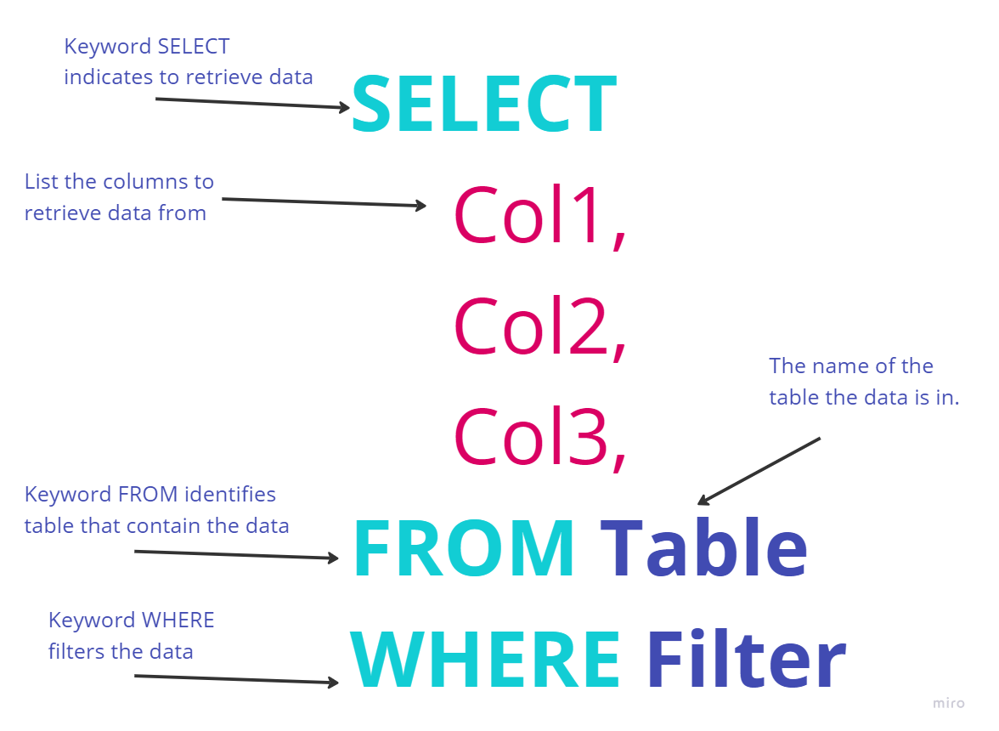
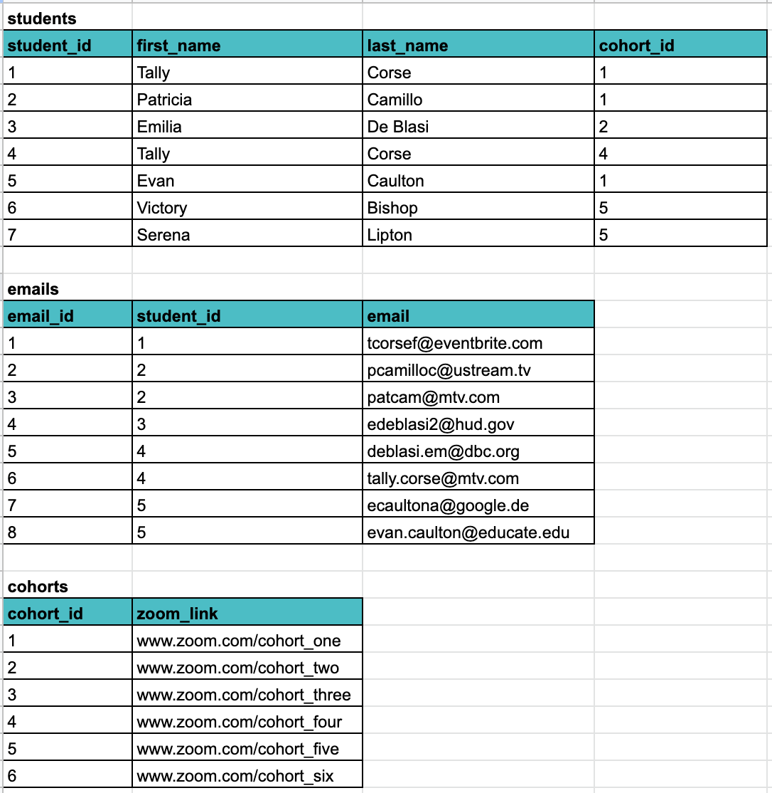
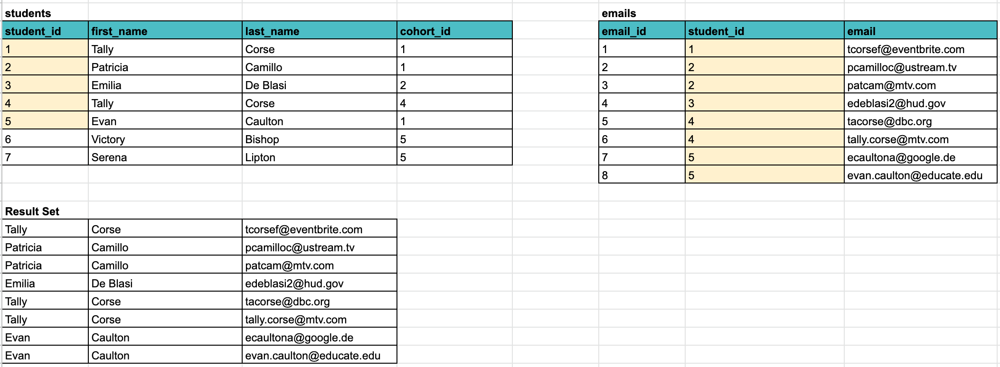
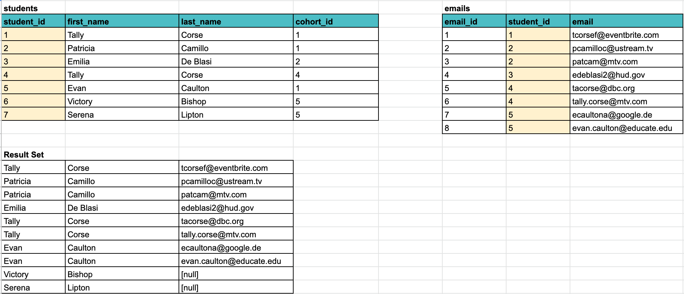

# Basics of Queries: Part 1


Download and install the carnival `.tar` file found [here](../data/carnival.tar) using the instruction in the installations guide.
 This is the database you'll use locally to practice all SQL operations.  Don't worry about messing it up. You can always delete and reinstall it.

## Background Information

Video (9 min): [SQL SELECT Tutorial |¦| SQL Tutorial |¦| SQL for Beginners](https://www.youtube.com/watch?v=YufocuHbYZo)

Retrieving data from a database is call querying.  For SQL databases, the`SELECT` statements is used.  Below is a diagram of a very simple query, selecting data from specific columns of every row in a single table. 



As shown in the image above, the `SELECT` keyword starts of the query, indicating that this is a retrieval of data.  Then the specific columns to retrieve are listed, separated with commas.  The column must exist in the table you list after the `FROM` keyword.  The `FROM` keyword is used before listing the table (or tables as you see soon) that the data is in.  If you do not know which columns to select, you can use an asterisk, to get a look at the data. 


In the first example, let's start off with a query to view all vehicles in your database.

```sql
SELECT * FROM Vehicles;
```

Using the asterisk (`*`) returns all columns in the query.  It is fine to use `*` in the initial phases of development, but important to be specific about the columns you want to view as you build your query. The query will run much faster and there's a lower risk of accidentally exposing data unintentionally.

You should also start getting into the habit immediately of using a table alias. Here is a query to view the engine size, floor price, and manufacturer price of all vehicles.  Note that the Vehicle table was aliased with the letter v, and all columns used that alias.

```sql
SELECT
    v.engine_type,
    v.floor_price,
    v.msr_price
FROM Vehicles v
```

### Filtering a Query

Most of the time, returning ony a sub-set of data is desired.  To do this, we need to have the query filter out some data a `WHERE` is added at the end of the query.  

Some examples include:

```
SELECT
    v.engine_type,
    v.floor_price,
    v.msr_price
FROM Vehicles v
WHERE floor_price  > 33564 
```
 The above example returns only vehicles with a floor_price greater than 33,564.  A number of different operators can be used to filter, including `=`, `<`, `>`, `!=`, `LIKE`, `NOT LIKE` and more can be utilized to filter data.  Multiple operators can be used with `AND` or `OR` to direct which data is returned. For Example:

 ```
SELECT
    v.engine_type,
    v.floor_price,
    v.msr_price
FROM Vehicles v
WHERE floor_price  > 33564 AND engine_type = 'V8'
```
The above example only returns records that have a floor_price greater than `33,564` AND an engine_type of `V8`. 

### Ordering Results

Often, you want the data to be returned in a specific order.  An `ORDER BY` clause at the end of your query will do this for you.  For example:

```
SELECT
    v.engine_type,
    v.floor_price,
    v.msr_price
FROM Vehicles v
WHERE floor_price  > 33564 AND engine_type = 'V8'
ORDER BY v.floor_price
```
will order the results by the price from lowest to highest. To sort from highest to lowest, use `DESC` in the `ORDER BY` like `ORDER BY v.floor_price DESC`.

### Limiting the number of results

Sometimes, you are just looking for a small number of results.  For example, you want the 5 least expensive cars with a 'V8' engine.  Simply use `LIMIT 5` after the ORDER BY and only the first 5 results will be returned.  If you would like the 5 most expensive, make sure to ORDER BY price DESC (Descending).

```
SELECT
    v.engine_type,
    v.floor_price,
    v.msr_price
FROM Vehicles v
WHERE floor_price  > 33564 AND engine_type = 'V8'
ORDER BY v.floor_price DESC
LIMIT 5;
```

### Joining multiple tables

Often data from multiple tables is needed from a single query.  To query multiple tables, a `JOIN` clause is used.  A `JOIN` clause allows us to access data from more than one table based on the relationships between the tables.  To join tables, there must be a common column between the two tables being joined.  Most often, the columns are the primary key in one table and the foreign key in a related table.  This is often your foreign key/primary key column in your ERD.  An `ON` clause is also need to define which columns to match.  Looking at the example below:

```
SELECT
    v.engine_type,
    v.floor_price,
    v.msr_price,
    s.invoice_number,
    s.price,
    s.deposit,
    s.purchase_date,
    s.pickup_date
FROM Vehicles v
JOIN sales s ON s.vehicle_id = v.vehicle_id
```

data was needed from both the Vehicles table and the Sales table.  Since the sales table has a foreign key (Fk) to the vehicles table, this connection was used to join the tables.  

### Inner, Outer and Left Joins

There are different ways data can be joined.  Each will affect what data is returned from the query.  By default, SQL will use `INNER` Join, but that is not always the best option for every business problem.  Here are the most common types of joins.

 - **Inner Join**: Only join data that is common to both tables. 
 - **Left/Right Join**: Return all data for one table and fill in data from that other table if it exists.  Return NULL where there is no matching data.
 - **Outer Join**: Return all data from both tables and fill in NULL for any data that does not exist.  

Let's use the following data to talk about three different kinds of joins: inner join, left join and outer join.




### Inner Join
n `INNER JOIN` lets us select data from two related tables. The two table names are listed on either side of the keywords `INNER JOIN`. Next comes the keyword `ON` followed by the join predicate. The join predicate is the condition that must be satisfied for the data to be selected from both tables.

Let's look at an example. We want the list of students who have email addresses in our database and the email addresses associated with each of those students.

This means that we will be doing a inner join between the students table and the emails table. The relationship between these two tables is one to many, one student can have many email addresses. Therefore, there's a FK for `student_id` on the emails table. We will utilize this relationship to write our join predicate.

```sql
SELECT
    first_name,
    last_name,
    email
FROM
    students
INNER JOIN emails
    ON students.student_id = emails.student_id;
```

For each row in the students table, inner join compares the value in it's `student_id` column with the value in the `student_id` column of every row in the emails table:

If these values are equal, the inner join creates a new row that contains the `first_name` and `last_name` columns from the students table and the `email` column from the emails table. This new row is then added to the result set.

In case these values are not equal, the inner join just ignores them and moves to the next row.



### Outer Join

As noted above, an INNER JOIN fetches data that is found in both tables.  An OUTER JOIN is the opposite, it returns all data from one or both of the tables.  There are three kinds of OUTER JOINS, FULL OUTER JOIN, LEFT OUTER JOIN, and RIGHT OUTER JOIN.  

A FULL OUTER JOIN returns all the rows from both tables, with missing data being returned as NULL.  LEFT OUTER JOIN, and RIGHT OUTER JOIN are usually shortened to LEFT JOIN and RIGHT JOIN and return all the rows from either the right or left table.  

### Left Join

With a left join, all the rows from the table listed on the left side of the keywords `LEFT JOIN` will be part of the result set regardless of the join predicate.

This time, we want all the students whether they have an email address or not.

```sql
SELECT
    s.first_name,
    s.last_name,
    e.email
FROM
    students s
LEFT JOIN emails e
    ON s.student_id = e.student_id;
```

For each row in students (the left table), it compares the value in it's `student_id` column with the value of each row in the `student_id` column of the emails table (the right table).

If these values are equal, the left join clause creates a new row that contains columns from both tables that we specified in the SELECT clause and adds this row to the result set.

If the values are not equal, the left join clause still creates a new row that contains our specified columns. In addition, it fills the columns that come from the right table with NULL.

> **NOTE:** We aliased the table names and used the alias in the ON clause.  Without the aliases, the ON clause would need to be `ON students.student_id = emails.student_id`



## Using an Alias

What exactly is an alias in SQL and how do we use it?  An alias is a temporary name assigned to a table, column, or a calculated field in a query. Aliases are used to make column names more readable or to allow them to be more easily referenced elsewhere in the SQL query. They can also be used to simplify table names to make queries shorter and more manageable.

When used in a FROM clause, an alias is assigned to a table name to simplify the SQL syntax, especially useful when performing joins or referencing the table multiple times. For example:

```SQL
SELECT
    e.full_name
FROM
    employees AS e
WHERE
    e.department_id = 5;
```

When used in a SELECT clause, an alias renames a column or an expression for the output of the query. This is often used for clarity or to format the output table in a specific way. To make column alias's with spaces, quotes are required.  For example:

```SQL
SELECT
    first_name || ' ' || last_name AS full_name,
    last_name AS "Last Name"
FROM
    employees;
```

## Practice


1. Write a query that returns the business name, city, state, and website for each dealership. Use an alias for the Dealerships table.
1. Get a list of Sales that include the first and last name of the customer, the sale price, the purchase date and the sale-type.  FIlter to return only Purchased vehicles that sold for more than $50,000.
1. Get a list of sales with the VIN of the vehicle, the first name and last name of the customer, first name and last name of the employee who made the sale and the name, city and state of the dealership.
1. Get a list of all the dealerships and the employees, if any, working at each one.
1. Get a list of all the dealerships and the employees, if any, working at each one.  Filter to only include Christophe Autos of Wisconsin, Andrysiak Autos of Iowa and Claypool Autos of Texas


 ## Additional Resources
- 📘 [SQL Joins](https://www.freecodecamp.org/news/sql-join-types-inner-join-vs-outer-join-example/)
- 📘 [PostgreSQL Joins](https://www.postgresqltutorial.com/postgresql-joins/)
- 📘 [PostgreSQL INNER JOIN](https://www.postgresqltutorial.com/postgresql-inner-join/)
- 📘 [PostgreSQL LEFT JOIN](https://www.postgresqltutorial.com/postgresql-left-join/)
- 📘 [PostgreSQL RIGHT JOIN](https://www.postgresqltutorial.com/postgresql-right-join/)
- 📺 [SQL Joins Explained (10 min)](https://www.youtube.com/watch?v=9yeOJ0ZMUYw)
- 📺 [SQL Joins Tutorial for Beginners (18 min)](https://www.youtube.com/watch?v=2HVMiPPuPIM)
