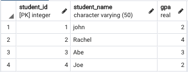
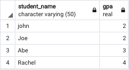
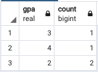

# Basics of Queries: Part 2

## Background Information
### Aggregation and Grouping

This evening we'll cover grouping and aggregation functions.  The functions

1. MAX()
2. MIN()
3. SUM()
4. COUNT()
5. AVG()

are aggregate functions.  These functions are usually used with the companion `GROUP BY` clause in `SELECT` queries.

### Group By
 The GROUP BY clause is used to group the results of a SELECT query based on one or more columns.

Consider a Student table that looks like this:



<br>
<br>

 Optional: The sql to create this table in your database can be found [here](../Code/day5.md).

 Example query to group students by their gpa.

 ```sql
 -- Here we want to query a list of students grouped by their gpa
SELECT student_name, gpa
FROM students_day5 GROUP BY gpa, student_name;
 ```
<br>

The Result would look like this:

 

<br>
<br>
Since we are including student_name in the query, it does not group the two gpa values that are the same.

We could also group gpa by using an aggregate function like COUNT.

```sql
 -- Here we want to query a list of students gpas and find how many times a particular gpa occurs.
SELECT gpa, count(gpa)
FROM Students GROUP BY gpa;
 ```
<br>

In this case, the two gpas that are the same are counted and combined into the same row.  
 
  


## Aggregate Functions

Aggregate functions run calculations on many rows and return one resulting row.

### `MAX()` - Returns the row with the maximum value

```sql
-- MAX statement to find the Highest GPA in the class:
SELECT MAX(gpa) FROM students_day5;
```

Another example, use MAX() to find the max sale price in Carnival.

```
SELECT MAX(price) FROM sales;
```
<br>

### `MIN()` - Returns the row with the minium value

```sql
-- MIN statement to find the lowest GPA in the class:
SELECT MIN(gpa) FROM students_day5;
```

Another example, use Min() to find the minimum sale price in Carnival.

```
SELECT MIN(price) FROM sales;
```
<br>

### `COUNT()` - Returns the number of rows

```sql
-- COUNT statement to find the total number of Students in a class:
SELECT COUNT(*) FROM students_day5;
```
<br>

```sql
-- COUNT statement to find how many students have a gpa greater than 2.5:
SELECT COUNT(gpa) FROM students_day5 where gpa > 2.5;
```
Example with Carnival, find the number of customers who purchased a vehicle in 2005.

```
SELECT COUNT(*)
FROM sales s 
WHERE EXTRACT(YEAR FROM purchase_date) = 2023;
```
<br>

### `AVG()` - Returns the mean of rows provided

```sql
-- AVG statement to find the average grade for students in a class:
SELECT AVG(gpa) FROM students_day5;
```

<br>

### `SUM()` - Returns the total sum of row values selected

```sql
-- SUM statement to find the total cost of all teacher salaries:
SELECT SUM(salaries) FROM Teachers;
```

## Practice

1. Find the largest deposit ever taken by the dealership "Mitkov Autos of California".
1. Find the total amount of sales made by Tadeas Mannagh.
1. Find the average sale price of all cars sold at Carnival.
1. Find how many Mazda CX-5 vehicles Carnival has ever had.
    - Bonus: Find how many Mazda CX-5 vehicles Carnival currently has in inventory.

## Additional Resources

- [Aggregate Functions in SQL](https://www.youtube.com/watch?v=sgAvl7ry5jY)
- [Aggregate Functions Tutorial](https://www.postgresqltutorial.com/postgresql-aggregate-functions/)
- [Understanding Group By Clause](https://www.youtube.com/watch?v=Yvuw0dbd7OQ)
- [Group By Tutorial](https://www.postgresqltutorial.com/postgresql-group-by/)


