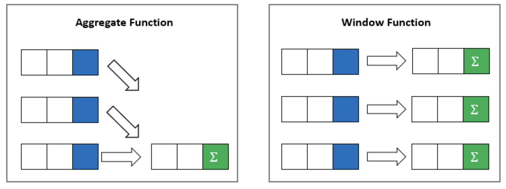

# Window Functions

## Background Information

Tonight's class covers window functions. Window functions leverage aggregate functions to take a deeper look into data sets.

Window functions can be identified by the `OVER()` keyword.

Aggregate functions aggregate data and return a single row. But what if you want to see counts as well as the breakdowns of individual records? This is where Window Functions come into play.

Window functions take aggregate data and displays them in context with more detailed data.

  

Let's say your customer wants a list of total sales per employee in the database.

A `SUM()` with a `GROUP BY` would give us this

```sql
select
	sales.employee_id,
	sum(sales.price) total_employee_sales
from
	employees
join
	sales
on
	sales.employee_id = employees.employee_id
group by
	sales.employee_id
```

The issue with this, is that you can't put names with the employees using a group by. You could put the select in a CTE or a subquery, or you could use a window function.

The `OVER()` function is what makes this a windows function. The default for `OVER()` is the entire rowset. It will apply the function--`SUM()`--to the entire dataset, in this case total sales. If we want to break the data into parts, we partition it by the data we want to group it by. In this query, we are partitioning by the employee id so get total sales per employee.

By running a windows function, we can get the employee's name, as well as aggregate queries all in one query.

```sql
select distinct
	employees.last_name || ', ' || employees.first_name employee_name,
	sales.employee_id,
	sum(sales.price) over() total_sales,
	sum(sales.price) over(partition by employees.employee_id) total_employee_sales
from
	employees
join
	sales
on
	sales.employee_id = employees.employee_id
order by employee_name
```

You can use windows functions to write many of the reports in the upcoming chapters.

## RANK AND ROW_NUMBER

RANK() and ROW_NUMBER() are window functions that assign a unique number to each row to which they are applied. Both functions are part of the SQL standard and are very useful for solving problems involving rankings or numbering rows based on specific criteria. These are commonly used to return data that is ordereded by an attribute that is not a standard column.

**ROW_NUMBER()** assigns a unique sequential integer to rows within a partition of a result set, starting at 1 for the first row in each partition.

For Example, to query dealerships and determine which made the most sales.

```SQL
SELECT 
    dealership_id,
    COUNT(dealership_id) AS total_sales,
    ROW_NUMBER() OVER (ORDER BY COUNT(dealership_id) DESC) AS sales_row_number
FROM 
    sales
GROUP BY 
    dealership_id
```

Notice in the above query, each dealership gets a unique row number, even when two dealerships have the same number of sales.

**RANK()** assigns a unique rank to each row within a partition of a result set, with gaps in the ranking for tied rows. When there are ties (i.e., two or more rows have the same rank criteria), RANK() assigns the same rank to all tied rows but skips subsequent ranks. For example, if two rows tie for rank 1, the next rank assigned will be 3.

For Example, to query dealerships and rank the dealerships by which made the most sales.

```SQL
SELECT 
    dealership_id,
    COUNT(dealership_id) AS total_sales,
    RANK() OVER (ORDER BY COUNT(dealership_id) DESC) AS sales_rank
FROM 
    sales
GROUP BY 
    dealership_id
```

Notice in this query that dealerships with the same number of sales have the same rank and that the rank will skip values when there are duplicates.


## Practice
*While several of these can be solved with a GROUP By, use a Window Function to get the answer.  

1. Write a query that shows the total purchase sales income per dealership.
1. Write a query that shows the purchase sales income per dealership for the current month.
1. Write a query that shows the total lease income per dealership.
1. Write a query that shows the lease income per dealership for Jan of 2020.
1. Write a query that returns the number of sales of each make.  The query should have 2 columns (NumSold and Make).  Which make is most popular in terms of number of sales?
	2. Bonus: Modify the query to include a RANK or ROW_NUMBER.


## Additional Resources

- [Intro to Window Functions](https://www.toptal.com/sql/intro-to-sql-windows-functions)
- [SQL Window Functions](https://www.sqltutorial.org/sql-window-functions/)
- [SQL Tutorial - Window Functions](https://www.youtube.com/watch?v=H6OTMoXjNiM)
