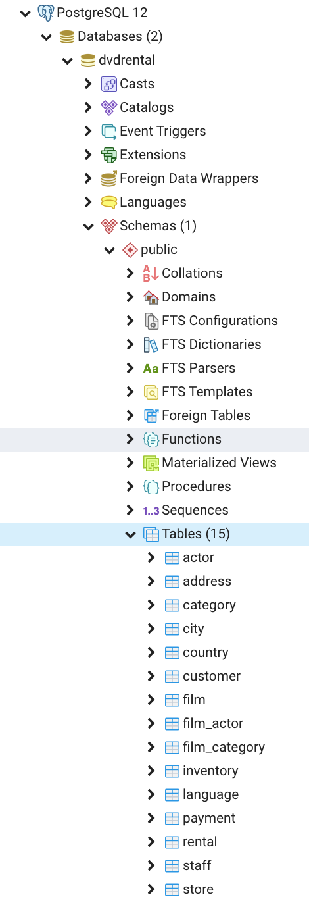

# Installations

## PostgreSQL

### Installing PostgreSQL Server & DBeaver

We will be using PostgreSQL throughout this course for your relational database management system. DBeaver is the GUI application we will use to manage and interact with our databases. And psql is the interactive terminal for Postgres.

## Install DBeaver and PostgresSQL drivers & Create a new database connection

1. Install [Postgres](https://www.postgresql.org/)
   - **Note to Mac users**: Do NOT use Homebrew to install Postgres
3. Install [DBeaver](https://dbeaver.io/download/)
4. Open DBeaver. Follow the menu for Database > New Database Connection. 
5. Select 'PostgresSQL', then click 'Next'
6. You will see a window to download PostgresSQL driver files. It should populate with files you will need to download that are required by the driver. Select 'Download'.
7. In 'Connection Settings', add the password that you setup when you installed Postgres. Otherwise, keep all default options in 'Connection Settings' and click 'finish'.
8. (In the future, you will only need to follow [these steps](https://dbeaver.com/docs/wiki/Create-Connection/) to create a new DB connection now that drivers are properly installed).

- To make it so that the databases show automatically when reloading DBeaver: 
   - On the connection, right-click -> Edit connection -> Connection settings -> on the tabbed panel, select PostgreSQL, check the box Show all databases.  [For more information click here](https://stackoverflow.com/questions/54235029/dbeaver-can-only-see-default-postgresql-database-in-connection)

- A setting you may want in DBeaver is to set your keywords to be automatically capitalized, check [this](https://stackoverflow.com/questions/42004796/how-to-switch-the-capitals-characters-transform-in-dbeaver) out.  Newer versions may look like:


## Loading a sample database

Once you are done with installations, continue the tutorial:

1. [Download the sample database](https://www.postgresqltutorial.com/wp-content/uploads/2019/05/dvdrental.zip). The database file is in zipformat (dvdrental.zip) so you need to extract it to 'dvdrental.tar' before loading the sample database into DBeaver.
2. Create a new database under your newly created database connection. After completing the 'new database connection' step, you should now see a connection 'postgres' in the database navigator on the left panel. Right click this. Create -> Database. Name the database 'movierental'.
3. Navigate to your newly created database; right click. Tools -> Restore. In settings, change the format to 'Tar'. For the Backup file, find the dvdrental.tar file from Step 1. 
- If you are on a Mac, the zip file doesn't extract to a .tar format. In the Restore Menu > Settings > Format Select "Directory" from the dropdown of selections.

#### Query Editor

Once you have restored the test database, you can see your tables by navigating into the `dvdrental > Schemas > Public > Tables`.



Now you can try running a query!

Make sure your dvdrental db is selected. In the image below, click the triangle next to SQL (labeled **1** in the image below) and select `New SQL Script` which opens your query editor. Type in the following:

```sql
SELECT
   first_name,
   last_name,
   email
FROM
   customer;
```

Click the icon labeled **2** to run your SELECT statement and make sure you get back results.


## Lucidchart

If you don't already have one, create a new Lucidchart account by going [here](https://app.lucidchart.com/users/registerLevel#/createAccount) and clicking the **Continue with Free** button.

## Google Account

If you do not have a Google email, please register for one [here](https://accounts.google.com/signup/v2/webcreateaccount?flowName=GlifWebSignIn&flowEntry=SignUp). This will be used primarily for utilizing Google Sheets.

## Github

Github is the primary site that software developers throughout the world use to store their code, and share it with other developers. Visit the [sign up page](https://github.com/join) and create your own, free account if you don't have one. We will be using this for class resources & curriculum.