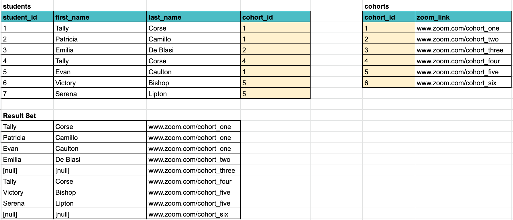

# More Practice
1. Write a query to return the first name, last name, email address and phone number for all customers and employees.
1. Write a query that returns the first name, last name, and email address of every customer. Use an alias for the Customers table.
1. Get a list of Sales that include the first and last name of the customer, the sale price and the purchase date.
1.  Get a list of Sales that include the first and last name of the customer, the sale price, the purchase date and the sale-type.
1. Get a list of all the dealerships and the employees, if any, working at each one.  Order by the dealership in reverse alphabetical order.
1. Get a list of vehicles with the names of the body type, make, model and color. Return results in order of make and model.

# More Concepts
## DISTINCT
The `DISTINCT` clause returns one row per any row of duplicates.  Compare the two queries

```
SELECT DISTINCT
make
FROM vehicleTypes
```
and

```
SELECT
make
FROM vehicleTypes
```

The one with the `DISTINCT` clause returns 5 unique rows while the query without the `DISTINCT` returns an entry for every row in the table.  This includes many duplicates.

DISTINCT can be used for both teasing out the distinct values of a column and for ensuring that no duplicate rows are returned from a larger query if it makes sense not to return them.

## ISNULL
The value `ISNULL` or `IS NOT NULL` is used with a `WHERE` to return rows that either do or do not contain data in a particular column.  

-- TO DO: ADD some NULL data to Carnival for an example

## LIKE & NOT LIKE

`LIKE` allows for searching with a partial value of column being searched.  Use `%` on either side as a wild card either before or after.  

```
SELECT 
* 
FROM vehicles
WHERE interior_color LIKE 'Aqua%'
```
In the above query, colors that start with 'Aqua' will be returned.  In Carnival, this is 'Aquamarine'.  To search the middle part of the string you would use the '%' on both sides like:

```
SELECT 
* 
FROM vehicles
WHERE interior_color LIKE '%mar%'
```
 and for only the latter part of the sting:

 ```
SELECT 
* 
FROM vehicles
WHERE interior_color LIKE '%ine'
```

The keyword `LIKE` can be used in a variety of situations when you don't know the exact value of the cell you need.  In addition, you can use `NOT LIKE` to return everything that does not contain the condition you are searching for.

## UNION

A `UNION` is used when you have two different datasets that you want to return as one.  Keep in mind that the datasets must return columns by the same name.  You may alias the columns if needed.  The below query will give a list of first and last names of all customers and employees in the system.

```
SELECT 
first_name, last_name
FROM Customers

UNION

SELECT 
first_name, last_name
FROM employees
```

## Right Join
The right join is the reverse of the left join. This means that all rows from the table on the right side of the `RIGHT JOIN` keywords will be returned in the result set regardless of whether there is an associated row in the table on the left side.

Let's get the zoom links for all the cohorts and the students, if any, that will be using each of the zoom links.

Keep in mind that students and cohorts have a many to one relationship, a cohort can have many students.

```sql
SELECT
    s.first_name,
    s.last_name,
    c.zoom_link
FROM
    students s
RIGHT JOIN cohorts c
    ON s.cohort_id = c.cohort_id;
```

For each row in cohorts (the right table), it compares each value in it's `cohort_id` column with each value in the `cohort_id` column of every row in students (the left table).

If these values are equal, the right join creates a new row that contains columns from both tables.

Else, the right join creates a new row that contains columns from both tables. However, it fills the columns in the left table with NULL.


## Additional Resources


